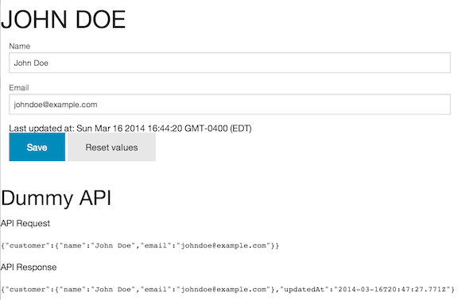

Bacon.Model Form example
========================

Inspired by: [Bacon Form Example](https://github.com/nnarhinen/bacon-form-example)

Also demonstrates how to use pre-compiled Handlebars templates with browserify.

Building
--------

 * `npm install`
 * `npm run watch`

It will create `dist/app.js`

Code
----

        var CustomerFields = new Enum(['name', 'email']);

        ...

        var name = Bacon.$.textFieldValue(this.element.find('input[name=' + CustomerFields.name.getName() + ']'));
        name.assign(this.element.find('h1.customer-name'), 'text');

        var email = Bacon.$.textFieldValue(this.element.find('input[name=' + CustomerFields.email.getName() + ']'));

        //var model = Bacon.Model.combine({name: name, email: email});
        var model = Bacon.Model({});
        model.lens(CustomerFields.name.getName()).bind(name);
        model.lens(CustomerFields.email.getName()).bind(email);

        var save = Bacon.fromEventTarget(this.element.find('button[type="submit"]'), "click")
            .doAction(".preventDefault");

        var request = Bacon.combineTemplate({customer: model});

        var submits = request.sampledBy(save)
            .flatMapLatest(function (req) {
                return Bacon.fromPromise(api.persistCustomer(req));
            });

        submits.onValue(_.bind(function (res) {
            $('.dummy-api').append('
API Response <pre>' + JSON.stringify(res) + '</pre>
');
        }, this));
